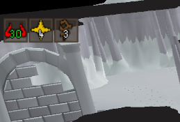
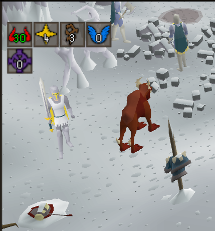

# Better Godwars Overlay
Get rid of that big clunky stinky Jagex overlay and replace it with a segsy sleek runelite one B)

- Uses your Runelite settings to look like the rest of the info boxes
- Allows you to move the overlay outside of the game frame
- Customisable colours
- Shorten God names for even more space
- Highlight kill count when you reach the amount for boss room entry!
- Option to replace overlay with compact info boxes

